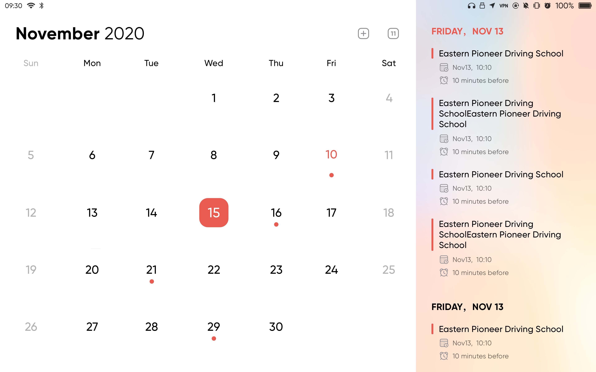

<!--
    SPDX-FileCopyrightText: 2021 Wang Rui <wangrui@jingos.com>
    SPDX-License-Identifier: CC-BY-SA-4.0
-->
# Calindori 

Calendar application for JingOS.


## Features

* Calindori is a touch friendly and beautiful calendar application. It offers:
*
  * Monthly agenda
  * Multiple calendars
  * Event management
  * Date and Event linkage

* Run on JingOS platform

* Brand new UI & UE with JingOS-style , based on JingUI Framework

* Support keyboard & touchpad & mouse & screen touch

* All keys support pressed / hovered effects

* Well-designed interface material:

  * Font
  * Icon
  * Picture

* The calendars that the application handles follow the [ical](https://tools.ietf.org/html/rfc5545) standard.


## Screenshots

Calindori:



JingOS:


## Links

* Home page: https://www.jingos.com/

* Project page: https://invent.kde.org/plasma-mobile/calindori

* Issues: https://invent.kde.org/plasma-mobile/calindori/-/issues

* Development channel: https://forum.jingos.com/


## Dependencies

* Qt5

* Cmake

* KI18n

* Kirigami (JingOS Version)

* KConfig

* KCalendarCore


## Build

To build Calindori from source on Linux, execute the below commands.


### Compile

```sh
cd Calindori
mkdir build
cd build
cmake ..
make -j$(nproc)
```


#### Run

```
bin/calindori
```


#### Install

```
sudo make install
```

